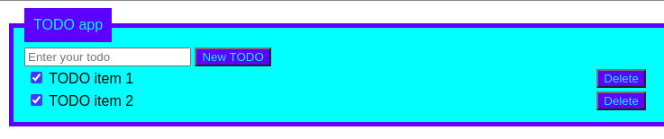

# TODO List
Simple TODO application written in PHP hosted on Google Cloud Compute Engine.  

## Project set up
1. Create service account and generate JSON key (see docs/dev_notes.md);
2. Create Cloud Storage bucket named <gcp_project_id>-tf-state;
3. Manually run GitHub Action or commit something;

## Tech Stack
### Application
* PHP, HTML, CSS
### Infrastructure
* Google Cloud Compute Engine
### CI/CD
* GitHub Actions
* Ansible
* Super Linter <https://github.com/marketplace/actions/super-linter/>
* Terraform on Google Cloud

## CI/CD pipeline steps
1. Run Super Linter pre-commit hook.
2. Run Super Linter on GitHub runner.
3. Create GCE instance using Terraform.
4. Copy runner SSH keys to GCE instance.
5. Setup the VM using Ansible playbook.
6. Deploy site using Ansible playbook.

## Resources
Google Compute Engine GitHub Actions example
<https://github.com/google-github-actions/setup-gcloud/blob/main/example-workflows/gce/.github/workflows/gce.yaml/>